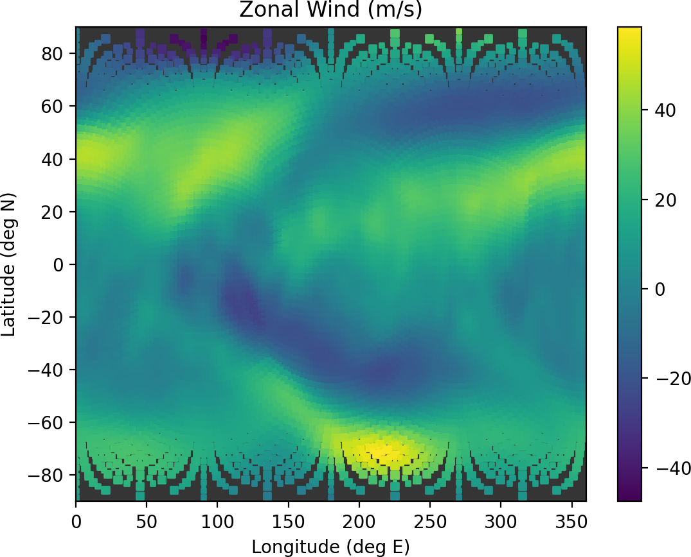

###########################
Creating a cube sphere case
###########################

.. important::

   CESM has already been ported and should work "out of the box" on most of the
   supercomputers that are widely used in the geosciences community, including
   Pleiades. When compiling the model, ensure to set the machine command line
   option, ``--mach`` to match the supercomputer you are working on. However,
   the modules that are installed on any machine change over time. CESM
   requires knowledge of which MPI and netCDF libraries are available. These
   modules are set in the ``config_machines.xml`` file.

config_machines.xml
===================

As of February 22, 2022, the ``config_machines.xml`` file is configured
properly to compile CESM on Pleiades Broadwell cluster which is denoted as 
``pleaides-bro``.

The ``config_machines.xml`` can be copied from:

.. code-block::

   /nobackup/bjohns28/CESM/cime/config/cesm/machines/config_machines.xml

to the analagous path in your own CESM installation or you can use the 
``create_newcase`` build script in this CESM installation.

Available grids
===============

Lauritzen et al. (2017) [1]_ list the available cube sphere grids in their
Table 1. A subset of their table is reproduced here.

+------------------------+--------------------------+-------------------------+
| Grid name              | Average node spacing     | Model timestep          |
+========================+==========================+=========================+
| ne16np4                | ∼208 km                  | 1,800 s                 |
+------------------------+--------------------------+-------------------------+
| ne30np4                | ∼111 km                  | 1,800 s                 |
+------------------------+--------------------------+-------------------------+
| ne60np4                | ∼56 km                   | 900 s                   |
+------------------------+--------------------------+-------------------------+
| ne120np4               | ∼28 km                   | 450 s                   |
+------------------------+--------------------------+-------------------------+
| ne240np4               | ∼14 km                   | 225 s                   |
+------------------------+--------------------------+-------------------------+

Building a case
===============

The scripts for building cases within CESM are part of a software collection
known as the Common Infrastructure for Modeling the Earth (CIME). This software
supports both NCAR models and those developed within the Department of Energy's
Energy Exascale Earth System Model (E3SM) collection. Thus the build scripts to
create a new case are contained within the ``cime`` subdirectory.

.. code-block::

   cd /nobackup/bjohns28/CESM/cime/scripts
   ls 
   climate_reproducibility  create_newcase  data_assimilation     lib           query_testlists  Tools
   create_clone             create_test     fortran_unit_testing  query_config  tests

The ``create_newcase`` script is invoked and passed command line arguments to
build a new case.

+-----------------------+-----------------------------------------------------------------+
| Command line option   | Meaning                                                         |
+=======================+=================================================================+
| ``--case``            | The directory the case will be built in. It is common practice  |
|                       | to include the experiment's grid resolution and component set   |
|                       | (described below) in the name of the case so that these aspects |
|                       | can be easily identified when browsing the file system later.   |
+-----------------------+-----------------------------------------------------------------+
| ``--compset``         | The component set of the experiment, including which            |
|                       | models will be actively integrating (atmosphere, land, ocean,   |
|                       | sea ice) and what boundary forcing will be used. CESM has an    |
|                       | extensive list of `component set definitions                    |
|                       | <https://www.cesm.ucar.edu/models/cesm2/config/compsets.html>`_ |
|                       | and these instructions using the ``FHIST`` compset, which has   |
|                       | an active atmospheric component, the Community Atmosphere Model |
|                       | version 6, and historical sea surface forcing, staring in 1979. |
+-----------------------+-----------------------------------------------------------------+
| ``--res``             | The grid resolution the model will run on. Each grid includes   |
|                       | at least two parts, the atmospheric/land grid and the ocean/sea |
|                       | ice grid to which it is coupled. These instructions use a       |
|                       | low-resolution cube-sphere grid for the atmosphere, ``ne30np4`` |
|                       | and couple it to a ~1° ocean/sea ice grid, ``gx1v7``. These     |
|                       | grid names are truncated into ``ne30_g17``. Again, CESM         |
|                       | has an extensive list of `available grids                       |
|                       | <https://www.cesm.ucar.edu/models/cesm2/config/grids.html>`_.   |
+-----------------------+-----------------------------------------------------------------+
| ``--mach``            | The upercomputer the case will be built on. These instructions  |
|                       | build a case on NCAR's Cheyenne computer, however, if you are   |
|                       | building on Pleiades, consult the table in the note below.      |
+-----------------------+-----------------------------------------------------------------+
| ``--project``         | The account code the project will be run on. When jobs from the |
|                       | experiment are run, the specified account will automatically be |
|                       | debited. Replace ``PXXXXXXXX`` with your project code.          |
+-----------------------+-----------------------------------------------------------------+
| ``--run-unsupported`` | Since the cube-sphere grid is a newly released aspect of CESM   |
|                       | that is not used in Coupled Model Intercomparison Project runs, |
|                       | it is not considered a scientifically supported grid yet. In    |
|                       | order to use it, you need to append this option.                |
+-----------------------+-----------------------------------------------------------------+

.. note::

   If you are building on ``pleiades``, the core layout per node differs based
   on which nodes you are using. These differences are alreay accounted for 
   within CESM. When specifying ``--mach`` there are four valid options:
   
   ======================  ===============================
   Compute node processor  Corresponding ``--mach`` option
   ----------------------  -------------------------------
   Broadwell               ``pleiades-bro``
   Haswell                 ``pleiades-has``
   Ivy Bridge              ``pleiades-ivy``
   Sandy Bridge            ``pleiades-san``
   ======================  ===============================

Identifying your GroupID
------------------------

You will need to find your GroupID on NASA systems using the ``groups``
command:

.. code-block::

   groups $USER
   <user> : sXXXX

Insert the returned group after the ``--project`` option when invoking
``create_newcase`` below.

To build a case using the ~1° ``ne30`` cube sphere grid:

.. code-block::

   mkdir /nobackup/bjohns28/cases
   cd /nobackup/bjohns28/CESM/cime/scripts
   ./create_newcase --case /nobackup/bjohns28/cases/FHIST.cesm2_2_0.ne30_g17.001 --compset FHIST --res ne30_g17 --mach pleiades-bro --project sXXXX --run-unsupported
   [...]
   Creating Case directory /nobackup/bjohns28/cases/FHIST.cesm2_2_0.ne30_g17.001
   
The case directory has successfully been created. Change to the case directory
and set up the case.

.. code-block::

   cd /nobackup/bjohns28/cases/FHIST.cesm2_2_0.ne30_g17.001     
   ./case.setup

The ``case.setup`` script scaffolds out the case directory, creating the
``Buildconf`` and ``CaseDocs`` directories that you can customize. These
instructions use the default configurations and continue on to compiling the
model. On machines such as pleaides that don't throttle CPU usage on the pfe
nodes, the ``case.build`` command can be invoked directly.

.. code-block::

   ./case.build

.. note::

   On Cheyenne, however, CPU intensive activities are killed on the login
   nodes, you will need to use a build wrapper to build the model on a shared
   compute node and specify a project code. Again, replace ``PXXXXXXXX`` with
   your project code.

   .. code-block::

      qcmd -q share -l select=1 -A PXXXXXXXX -- ./case.build

The model build should progress for several minutes. If it compiles properly,
a success message should be printed.

.. code-block::

   [...]
   Time spent not building: 20.459729 sec
   Time spent building: 719.937638 sec
   MODEL BUILD HAS FINISHED SUCCESSFULLY

The model is actually built and run in a user's scratch space.

.. code-block::

   /nobackup/bjohns28/FHIST.cesm2_2_0.ne30_g17.001/bld/cesm.exe

Submitting a job
================

To submit a job, change to the case directory and use the ``case.submit`` 
script. The ``-M begin,end`` option sends the user an email when the job starts
and stops running.

When the case is built, its default configuration is to run for five model
days. This setting can be changed to run for a single model day using 
``./xmlchange STOP_N=1``.

.. code-block::

   cd /nobackup/bjohns28/cases/FHIST.cesm2_2_0.ne30_g17.001
   ./xmlchange STOP_N=1
   ./case.submit -M begin,end

Restart file
============

After the job completes, restart files are written to the run directory which
is also in scratch space. These restart files are written for both active and
data components. The CAM restart file contains a ``cam.r`` substring. By
default, the ``FHIST`` case begins on January 1st, 1979. Thus, the restart file
will be for January 2nd, 1979.

.. code-block::

   /nobackup/bjohns28/FHIST.cesm2_2_0.ne30_g17.001/run/FHIST.cesm2_2_0.ne30_g17.001.cam.r.1979-01-02-00000.nc

The fields in the restart file can be plotted using various langauges such as 
MATLAB or Python's matplotlib, as seen here.

|plot_cube_sphere|

References
==========

.. [1] Lauritzen, P. H., and Coauthors, 2018: NCAR Release of CAM-SE in
       CESM2.0: A Reformulation of the Spectral Element Dynamical Core in
       Dry-Mass Vertical Coordinates With Comprehensive Treatment of
       Condensates and Energy. Journal of Advances in Modeling Earth Systems,
       **10**, 1537–1570,
       `doi:10.1029/2017MS001257 <https://doi.org/10.1029/2017MS001257>`_.

